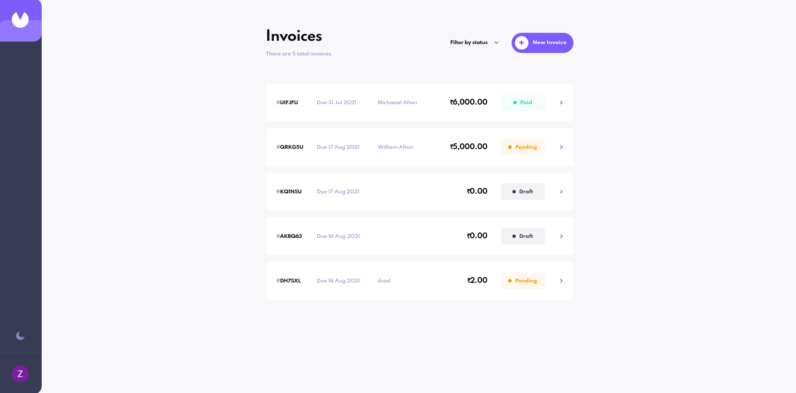
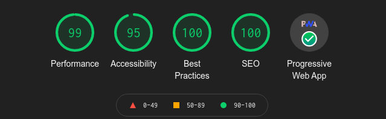
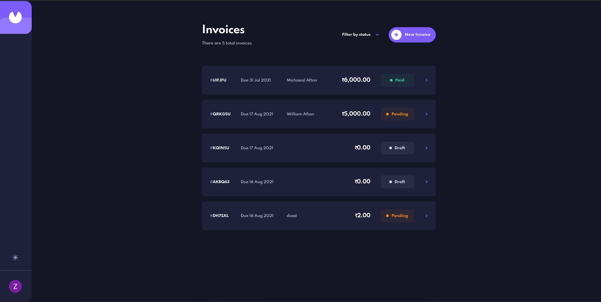
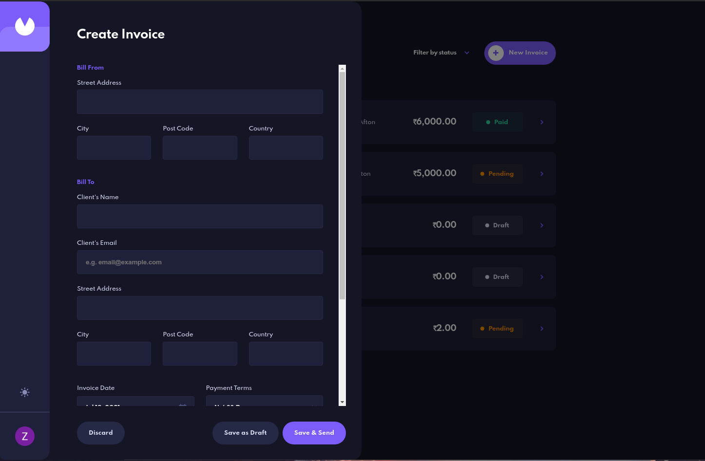
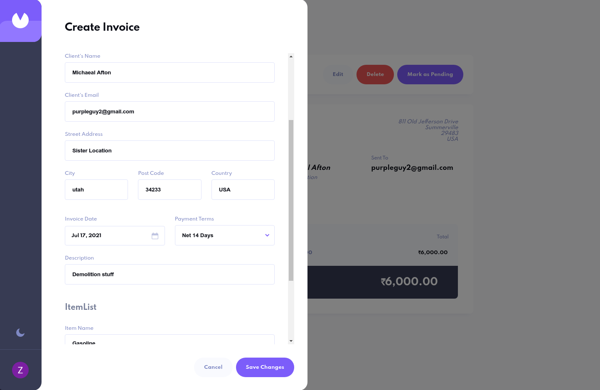
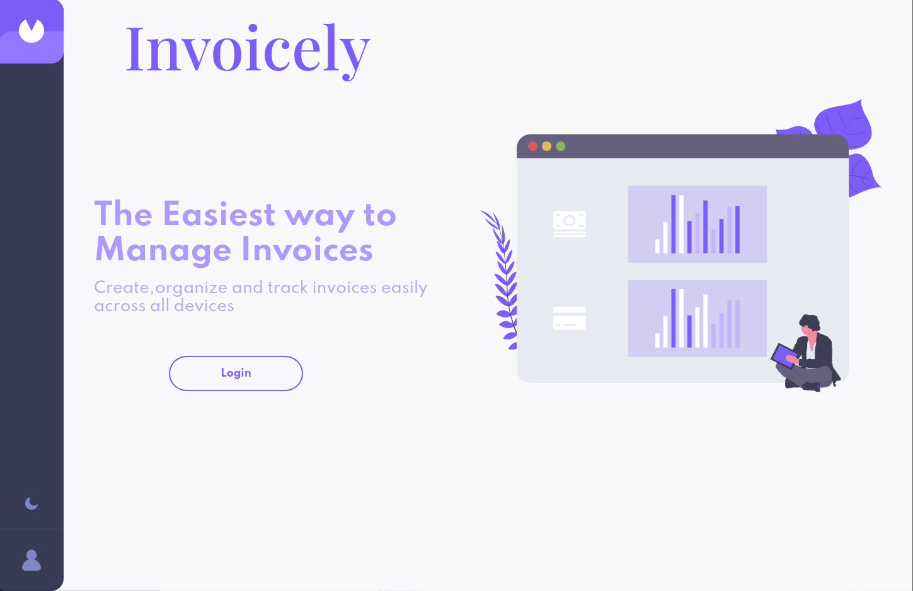
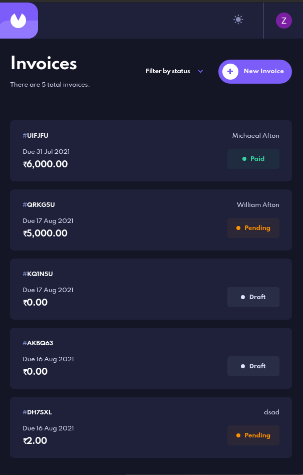

# Invoicely -Frontend Mentor 

:star: Star me on GitHub — it motivates me a lot!

[Invoicely](https://invoicely.vercel.app/) is a professional, full-featured and
high performance web app for Invoices! You can acess the web site with a click and you can create, manage, update
and customize invoices to your needs.
[](https://invoicely.vercel.app/)

## Table of contents

- [Overview](#overview)
  - [Key Features](#key-features)
  - [Link](#link)
  - [Audit](#audit)
  - [Built with](#built-with)
- [Development](#development)
  - [What I learned](#what-i-learned)
  - [Continue development](#continue-development)
  - [What I would do differently](#what-i-would-do-differently)
- [More Preview](#more-preview)  


## Overview

### Key Features
    - The app allows users to login via google account.
    - Create, read, update, and delete invoices.
    - Filter invoices by status.
    - Form validation for updating and creating invoices.
    - Responsive and interactive webpages.
    - Data synchronisation.
    - Toggle light and dark mode.
    - Supports multiple devices.

### Link
    - Live Site URL: [https://invoicely.vercel.app/](https://invoicely.vercel.app/)

### Audit

        

### Built with
    - **React**: Framework for building this project.
    - **Create-React-App**: Environment for building the project,comes with boilerplate and preconfigured webpack.
    - **Firebase**: For Authentication and  data management and restrictions

## Development

### What I Learned
    This is one of the biggest projects i build with react,it comes with alot of libraries that i learned and implemented.Some of these are:
    - **Formik**: Handling form data  in the site.
    - **Yup**: Provide validation schema for formik.
    - **Helmet-async**: To manage the head tags and meta tags for SEO (this is a fork of react-helmet and it is much better)
    - **Framer-motion**: For those buttery smooth animations (couldn't find any advanced guides or tutorials )
    - **React-datepicker**: Now this was a mess to work with(spend most time customizing the design)
    - **Infinite-Scroll**: Used this with firebase to limit request for queries.Learned to control the data flow.
    Other things i learned, about firebase authentication and setting up security rules for request.Learned about reusable components,state management and optimising react components.

### Continue Development
    Prerequisite for development with this application, you will need [Git](https://git-scm.com/),[NodeJs](https://nodejs.org/en/) and an account in [Firebase](https://firebase.google.com/)

   ```bash

   #Clone this repo
   $ git clone https://github.com/niranjraj/invoice-app.git
    
   #Cd into the repo
   $ cd invoice-app

   #Install the dependencies in the package.json
   $ npm install # or yarn

   #Start development server
   $ npm run start  # or yarn start

   ```
   make sure to setup apikeys of firebase in a .env file at the root of project for authentication and database to work.

### What I would do differently
    - For future projects i will use NextJs instead of Create-react-app,for server side rendering ,build in routing and better SEO.
    - Some reusable code was never turned into components in this project and better structure for the styles.
    - Spend more time with framer motion and formik.
    - TypeScript.

## More Preview

### Dark mode 
        

### Form 
        

### Edit Form
       

### Main 
      

### Mobile
      
